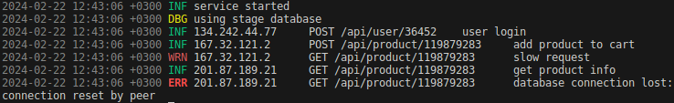

# LogX

**LogX** (**Log eXtended**) - это библиотека логирования, которая может записывать логи в поток данных, используя свой собственный стандартный логгер, а также записывать логи в базы данных, лог-файлы и т. п., используя пользовательские реализации писателей логов.



## Реализация писателя логов

Для того, чтобы подключить к работе по отправке лог-сообщений свой **писатель логов**, создайте тип переменной в вашем проекте, который реализует интерфейс `LogWriter` из пакета `logx` (корневой директории проекта):

``` Go
type LogWriter interface {
	WriteLog(time time.Time, level LogLevel, msg string) error
}
```

Чтобы получать **текстовые обозначения** текущего **уровня лога** в вашем методе `WriteLog` воспользуйтесь следующей функцией:

``` Go
logx.LevelText(level logx.LogLevel)
```

Также можно получать **цветовые коды** для смены цвета текста в терминале. Данные коды меняют цвет выводимого текста, когда стоят перед ним. Для получения кода, раскрашивающего обозначение уровня логов, вызовите в методе `WriteLog` функцию:

``` Go
logx.LevelColor(level logx.LogLevel)
```

Для получения файла ОС, представляющего **выходной поток данных**, чаще всего используемый для вывода конечных лог-сообщений (**stderr**), вызовите следующую функцию:

``` Go
logx.Output()
```

## Системные требования

**Операционная система:**

- Windows / MacOS / Linux.

**Программное обеспечение:**

- средства разработки языка Go >=v1.12;
- утилита make (только для запуска демонстрации).

## Демонстрация

Обычная демонстрация.

```
make demo
```

Демонстрация логов сетевых запросов.

```
make demo2
```

Выполнение сравнительных бенчмарков.

```
make benchmarks 
```

## Импортирование

Для использования данной библиотеки в своем проекте, добавьте следующую строку в исходный код приложения, в секцию **импорта**:

``` Go
import (
	"github.com/mrumyantsev/logx/log"
)
```

Для изменения настроек посредством файла конфигурации и использования констант, а также для получения **уровня лога** при создании реализации писателя, используйте импортирование корневого пакета:

``` Go
import (
	"github.com/mrumyantsev/logx"
)
```

## Настройка

Следующая команда создает **файл конфигурации**, с помощью которого можно более детально настроить логи в своем проекте.

``` Go
loggerCfg := &Config{
	IsDisableDebugLogs: false,
	IsDisableWarnLogs: false,
	IsDisableStandardLogger: false,
	IsDisableColors: false,
	TimeFormat: logx.TimeFormat,
	Output: logx.Output(),
}
```

Данная функция получает созданный конфигурационный файл и применяет его настройки к работе писателей логов.

``` Go
log.ApplyConfig(cfg *logx.Config)
```

## Работа с логгером

Данная функция включает одного или нескольких писателей логов в процесс одновременного ведения логов и помещает их во встроенное хранилище. Аргументы со значением `nil` игнорируются.

``` Go
log.AddWriters(w ...logx.LogWriter)
```

Функция ниже делает обратное&nbsp;&mdash; извлекает одного или нескольких писателей из хранилища, и они перестают использоваться для ведения логов. Аргументы со значением `nil` игнорируются.

``` Go
log.RemoveWriters(w ...logx.LogWriter)
```

Данная функция логирования предназначена для записи сообщений уровня **info**. Обычно это информативные сообщения о событиях в приложении.

``` Go
log.Info(msg string)
```

Данная функция логирования предназначена для записи сообщений уровня **debug**. Такие сообщения могут быть использованы для выявления дефектов или краевых случаев в работе программы. (Могут быть выключены.)

``` Go
log.Debug(msg string)
```

Данная функция логирования предназначена для записи сообщений уровня **warn**. Эти сообщения могут быть предостережениями от непредвиденных последствий, при нестандартных ситуациях. (Могут быть выключены.)

``` Go
log.Warn(msg string)
```

Данная функция логирования предназначена для записи сообщений уровня **error**. Такие сообщения явным образом говорят о возникшей проблеме, которая может привести к поломке приложения и потере данных. Значение `err` может быть равно `nil`.

``` Go
log.Error(desc string, err error)
```

Данная функция логирования предназначена для записи сообщений уровня **fatal** и завершения приложения с кодом, не равным 0. Это последние сообщение, перед аварийным закрытием программы, указывающее на причину поломки, а также помогающее определить это место в коде. Значение `err` может быть равно `nil`.

``` Go
log.Fatal(desc string, err error)
```

Данная функция делает то же самое, что и предыдущая, только с дополнительной возможностью установки нестандартного **кода завершения**. Значение `err` может быть равно `nil`.

``` Go
log.FatalWithCode(desc string, err error, exitCode int)
```

Данная функция логирования предназначена для записи сообщений уровня **panic** и остановки программы, если не будет вызвана функция `recover`. Паники&nbsp;&mdash; это критические ошибки в языке Go, которые не определяются на этапе компиляции, и могут быть вызваны благодаря ошибкам в коде. К таким ошибкам относятся: недопустимый доступ к памяти (индексация массива за пределами его емкости), неверное приведение типов, вызов методов с указателем `nil`, некорректное использование мьютексов и попытки работы с закрытыми каналами. Значение `err` может быть равно `nil`.

``` Go
log.Panic(desc string, err error)
```

В данной библиотеке реализованы функции с **дублированными именами** функций из пакета `log` стандартного логгера языка Go, для упрощения перехода на **LogX**:

``` Go
log.New(out *os.File, prefix string, flag int)
log.Default()
log.SetOutput(f *os.File)
log.Writer()
log.Print(v ...interface{})
log.Printf(format string, v ...interface{})
log.Println(v ...interface{})
log.Fatalf(format string, v ...interface{})
log.Fatalln(v ...interface{})
log.Panicf(format string, v ...interface{})
log.Panicln(v ...interface{})
```
